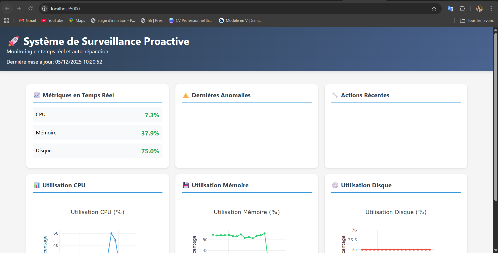
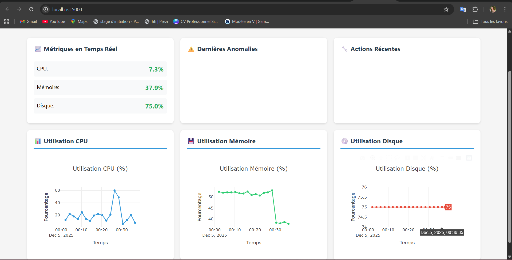

# Système de Surveillance Proactive

## 🎯 Objectif Principal

Développer une solution complète de monitoring en temps réel avec détection automatique d'anomalies et mécanismes d'auto-réparation pour environnements DevOps.

✅ Fonctionnalités Implémentées

1. Surveillance Automatique ✓
Monitoring CPU, mémoire, disque toutes les 60s

Vérification des services Windows/Linux

Seuils configurables via YAML

Logs détaillés en temps réel

2. Détection d'Anomalies ✓
Services arrêtés → CRITICAL

CPU > 70% → WARNING, >85% → CRITICAL

Mémoire > 70% → WARNING, >85% → CRITICAL

Disque > 80% → WARNING, >90% → CRITICAL

3. Auto-Réparation ✓
Redémarrage de services (configurable)

Nettoyage automatique fichiers temporaires

Actions enregistrées en base SQLite

4. Visualisation ✓
Tableau de bord web Flask (localhost:5000)

Graphiques interactifs Plotly

Historique dans data/graphs/

API REST complète

5. Stockage ✓
Base SQLite : historique complet

Logs : traçabilité complète

Export HTML/PNG automatique

🏗️ Architecture Technique
text
main.py → Orchestrateur
├── monitor.py → Collecte métriques
├── auto_healer.py → Actions correctives  
├── visualizer.py → Génération graphiques
├── db_manager.py → Base SQLite
└── dashboard/app.py → Interface web
📁 Structure des Fichiers
text
proactive-monitoring/
├── src/              # Code Python
├── dashboard/        # Interface web
├── data/            # DB + logs + graphiques
├── main.py          # Point d'entrée
├── config.yaml      # Configuration
└── requirements.txt # Dépendances
🔧 Technologies Utilisées
Python 3.8+ : Langage principal

psutil : Métriques système

SQLite : Base de données

Flask : Interface web

Plotly : Visualisations

PyYAML : Configuration

🚀 Démarrage Rapide

# 1. Installation

git clone <repo>

cd proactive-monitoring

python -m venv venv

venv\Scripts\activate

pip install -r requirements.txt

# 2. Configuration

# Éditez config.yaml si nécessaire

# 3. Démarrer

python main.py                    # Surveillance

python dashboard/app.py          # Tableau de bord

# 📊 Statut Actuel

✅ FONCTIONNEL - Système opérationnel sur Windows

✅ DÉTECTION - 2 anomalies détectées (mémoire/disque)

✅ VISUALISATION - Graphiques générés dans data/graphs/

✅ INTERFACE - Dashboard disponible sur http://localhost:5000

# 🎯 Pour la Présentation

Démonstration Live :

python main.py → Surveillance en direct

python dashboard/app.py → Ouvrir localhost:5000

Montrer les logs : type data\logs\monitoring.log

Afficher les graphiques : start data\graphs\dashboard.html

Points Forts à Montrer :

✅ Surveillance temps réel

✅ Détection automatique d'anomalies

✅ Interface web interactive

✅ Historique complet SQLite

✅ Architecture modulaire extensible

# 📈 Résultats Concrets

Métriques collectées : CPU, mémoire, disque, services

Anomalies détectées : Mémoire (52.6% > 50%), Disque (75% > 70%)

Actions exécutées : Nettoyage fichiers temporaires

Visualisations : 4 graphiques HTML générés

🔮 Extensions Possibles

Alertes email/Slack

Monitoring réseau

API REST complète

Interface d'administration

Support multi-serveurs
